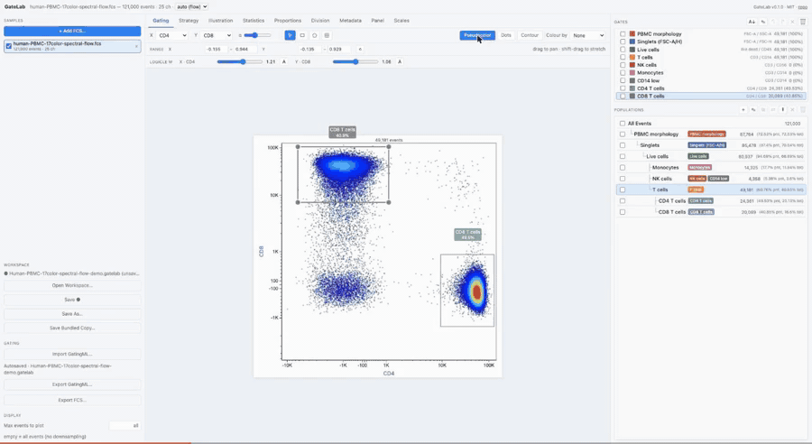

# GateLab

GateLab is a browser-based application for manually gating flow-cytometry and mass-cytometry (CyTOF) FCS files. It runs entirely in your web browser—no R installation or server-side analysis is required.

## [Launch GateLab in your browser →](https://david-priest.github.io/GateLab/)

No installation is required for the hosted app. Your FCS files and workspaces are
processed locally in your browser and are not uploaded for analysis. GateLab can also be
installed and run locally using the instructions below.

GateLab is a standalone reimplementation of
[GateLabR](https://github.com/david-priest/GateLabR) — it reuses GateLabR's vendored D3
plotting modules and reimplements its R analysis engine in TypeScript, so gating runs
entirely in the browser with no R backend.

## GateLab in action



## GateLab or GateLabR?

GateLab and [GateLabR](https://github.com/david-priest/GateLabR) share the same gating
model and interactive plotting approach. Choose the version that best matches where your
data already lives:

| | GateLab | GateLabR |
|---|---|---|
| Runs in | A local web browser | R / Shiny |
| Best starting point | FCS files | A `SingleCellExperiment` (or FCS files) |
| Workspace | Self-contained `.gatelab` bundle | Gating metadata stored inside the SCE |
| Downstream hand-off | FCS, Gating-ML, statistics and figures | Populations in `colData`, plus FCS, Gating-ML, statistics and figures |
| Install | Open the hosted app, or use Node.js + `npm` locally | R + Bioconductor dependencies |

GateLab is a standalone TypeScript port for users who do not need an R environment. Its
interactive plots reuse GateLabR's D3 modules, while its analysis engine independently
implements FCS parsing, logicle/arcsinh transforms, compensation, gate membership,
population evaluation, statistics, Gating-ML 2.0 import/export and FCS export. These
low-level operations are covered by unit tests and cross-language fidelity fixtures
derived from GateLabR.

## Using GateLab

GateLab runs entirely in a modern web browser, either from the hosted app or from a local
installation. Chrome or Microsoft Edge are recommended for the best file open and save
experience.

## Features

- Multi-sample workspace with a shared gating tree across freely added or removed FCS
  files, with overlay / comparison across samples.
- Interactive gating: rectangle / polygon / quadrant gates, drag-to-edit, positive
  AND population hierarchies, and a population tree with counts / %parent / %total.
- Tabs: Gating, Strategy (single + multi-population back-gating), Illustration, Statistics,
  Panel, Scales, Division profiler, Proportions, Metadata.
- Illustration figures include biplot and histogram grids, stacked ridgelines, and
  population-by-channel median / mean expression heatmaps with explicit scaling,
  palette, cell-value, and vector-export controls.
- Import / export **Gating-ML 2.0** (GateLabR / Cytobank dialects); export populations as
  **FCS**; SVG / PDF figure export.
- Self-contained `.gatelab` workspace bundle (workspace + original FCS + Gating-ML), with
  open → edit → save-in-place and debounced autosave.

GateLab currently uses positive AND population logic. Gating-ML files containing NOT
or OR populations, or gates whose channels cannot be matched to the loaded data, are
rejected before import with the affected populations, gates, and channels named. This
prevents partial imports from silently changing membership. Broader Boolean logic may
be considered in a future update if there is user demand.

## How GateLab compares with other tools

GateLab is designed for researchers who want to leave proprietary cytometry software
without giving up a familiar manual-gating workflow. It runs locally in the browser,
uses portable self-contained workspaces and exchanges gates through Gating-ML—without
requiring R or a commercial desktop/cloud platform.

| | GateLab | FlowJo | Cytobank | CytoExploreR / flowGate |
|---|---|---|---|---|
| Interface | Local browser app | Desktop GUI | Cloud GUI | R with interactive gating helpers |
| Cost / license | Free, MIT, open source | Commercial | Commercial | Free, open source |
| Workspace and data | Self-contained `.gatelab` bundle with FCS files and gates | `.wsp` workspace linked to local FCS; ACS can bundle both | Cloud experiment | `GatingSet` / R objects |
| Gate exchange | Gating-ML 2.0 import and export | `.wsp` / `.wspt` workspace formats | Gating-ML 2.0 import and export | `flowWorkspace` / `CytoML` ecosystem |
| R required | No | No | No | Yes |
| Processing location | Local browser | Local desktop | Cloud | Local R session |
| Best suited to | Open-source FCS gating with portable local workspaces | Established desktop cytometry workflows | Shared cloud-based experiments | Scriptable R / `flowWorkspace` pipelines |

See the official documentation for [FlowJo workspace and export
formats](https://docs.flowjo.com/flowjo/getting-acquainted/fj-export/),
[Cytobank Gating-ML exchange](https://support.cytobank.org/hc/en-us/articles/204765618-Exporting-and-Importing-Gates-within-Cytobank-and-with-Gating-ML),
and the Bioconductor [`flowGate` package](https://bioconductor.org/packages/flowGate/).

FlowJo is a trademark of Becton, Dickinson and Company. GateLab is an independent
project and is not affiliated with or endorsed by BD or FlowJo.

## Local installation

### What you need

- A current [Node.js LTS](https://nodejs.org/) installation (which includes `npm`).
- A Chromium-based browser such as Google Chrome or Microsoft Edge. GateLab uses the browser's File System Access API for opening and saving workspaces.

### Run GateLab locally

```sh
# Clone the repository and its GateLabR plotting-module submodule, then enter it.
git clone --recurse-submodules https://github.com/david-priest/GateLab.git
cd GateLab

# Install the JavaScript dependencies (needed only after cloning or when they change).
npm install

# Start GateLab.
npm run dev
```

If you already cloned GateLab without submodules, initialise them once before running
`npm install`:

```sh
git submodule update --init --recursive
```

Open the local URL printed in the terminal (normally <http://localhost:5173>) in Chrome or Edge. Leave that terminal running while using the app; press `Ctrl+C` there when you are finished.

### First workspace

1. Create a new workspace or open an existing `.gatelab` workspace.
2. Add one or more `.fcs` files.
3. Select a population and use the Gating tab to choose markers, inspect the plot, and draw rectangle, polygon, or quadrant gates.
4. Review population counts and percentages in the tree and Statistics tab. Use the other tabs to inspect strategy, panel, scales, proportions, and metadata.
5. Save the workspace as a `.gatelab` bundle to retain its FCS inputs and gating strategy. You can also export Gating-ML, statistics, figures, or gated populations as FCS as needed.

## Development commands

```sh
npm run dev      # Vite development server (normally :5173)
npm test         # Vitest engine unit tests
npm run build    # Type-check and create a production build
```

## Issues and feature requests

Found a bug or have an idea that would make GateLab more useful? Please
[open an issue](https://github.com/david-priest/GateLab/issues) with the details. Bug
reports and feature requests are welcome.

## License

MIT — see [LICENSE](LICENSE). GateLab bundles GateLabR's MIT-licensed D3 modules (license
retained at `vendor/GateLabR/LICENSE`) and d3.v7 (ISC, © Mike Bostock). Bundled third-party
components and their licenses (including DOMPurify, MPL-2.0/Apache-2.0, via jsPDF) are listed in
[THIRD-PARTY-NOTICES.md](THIRD-PARTY-NOTICES.md).
