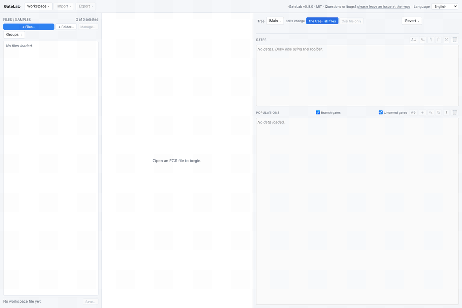

# GateLab

GateLab is a browser-based application for manually gating flow-cytometry and mass-cytometry (CyTOF) FCS files. It runs entirely in your web browser—no R installation or server-side analysis is required.

GateLab is a standalone reimplementation of
[GateLabR](https://github.com/david-priest/GateLabR) — it reuses GateLabR's vendored D3
plotting modules and reimplements its R analysis engine in TypeScript, so gating runs
entirely in the browser with no R backend.

## [Launch GateLab in your browser →](https://david-priest.github.io/GateLab/)

No installation is required for the hosted app. Your FCS files and workspaces are
processed locally in your browser and are not uploaded for analysis. GateLab can also be
installed and run locally using the instructions below.


## GateLab in action



## GateLab or GateLabR?

GateLab and [GateLabR](https://github.com/david-priest/GateLabR) share the same gating
model and interactive plotting approach. Choose the version that best matches where your
data already lives:

| | GateLab | GateLabR |
|---|---|---|
| Runs in | A local web browser | R / Shiny |
| Best starting point | FCS files | A `SingleCellExperiment` (or FCS files) |
| Workspace | Self-contained `.gatelab` bundle | Gating metadata stored inside the SCE |
| Downstream hand-off | FCS, Gating-ML, FlowJo workspaces, statistics and figures | Populations in `colData`, plus FCS, Gating-ML, statistics and figures |
| Install | Open the hosted app, or use Node.js + `npm` locally | R + Bioconductor dependencies |

GateLab is a standalone TypeScript port for users who do not need an R environment. Its
interactive plots reuse GateLabR's D3 modules, while its analysis engine independently
implements FCS parsing, logicle/arcsinh transforms, compensation, gate membership,
population evaluation, statistics, Gating-ML 2.0 import/export, FlowJo workspace import/export
and FCS export. These
low-level operations are covered by unit tests and cross-language fidelity fixtures
derived from GateLabR.

## Using GateLab

GateLab runs entirely in a modern web browser, either from the hosted app or from a local
installation. Chrome or Microsoft Edge are recommended for the best file open and save
experience.

## Features

- Multi-sample workspace with one population tree that every file follows, with overlay /
  comparison across samples. A file, or a named group of files, can tailor a gate's
  coordinates and keep them until reverted or applied back to the tree; the structure stays
  the same for every file. See "One tree per workspace" below.
- Interactive gating: rectangle / polygon / ellipse / quadrant gates, drag-to-edit, positive
  AND population hierarchies, and a population tree with counts / %parent / %total. A quadrant
  can be curly, as in FlowJo: beyond the crosshair its arms bend toward the upper right, and a
  handle at the end of each arm sets the bend. FlowJo's own curly quads import as curly
  quadrants with the bend fitted against FlowJo's counts (FlowJo writes the bend nowhere).
- Tabs: Gating, Strategy (single + multi-population back-gating), Illustration, Plotting
  (proportions and composition by file or metadata), Division profiler, Statistics, Metadata,
  Panel, Compensation, Scales.
- Illustration figures: a figure workspace with nested rows, columns and pages of files,
  populations and channels, grouping by sample metadata, overlays or pooling, biplots with
  gates and draggable labels, histograms, ridgelines and population-by-channel heatmaps, axes
  that follow the Gating tab, and PNG, PDF and SVG export.
- Compensation: an embedded or imported spillover matrix for conventional flow (matrix
  inverse), NNLS spillover correction for mass cytometry, or a matrix started empty and set
  by hand, with a per-coefficient preview and a Remove that returns to the original values.
- Colour the gating plot by a third marker, by population, by sample or by a metadata column.
- Import / export **Gating-ML 2.0** (GateLabR / Cytobank dialects); export populations as
  **FCS**; SVG / PDF figure export.
- Import gates from a **BD FACSChorus experiment file** (`.cef`, the FACSDiscover S8's): the
  gates as they are now, or the snapshot every sort record keeps of the gates it was sorted
  under, with the colours Chorus drew them in. Gates on linear axes import exactly; gates on
  Chorus's biexponential or log axes import straight in raw space and say so (within 2.4% of
  Chorus's own counts in the experiment checked), because Chorus's automatic display width is
  computed from the data and not written to the file. **Compare with FACSChorus statistics…**
  reads the `_Statistics.csv` Chorus exports and sets its population counts per recording
  beside GateLab's on the file of the same name, with the reason for every difference.
- Every FCS the S8 exports carries the gates it was recorded under (a `BDCHORUSDATARECORD`
  keyword). **Import gates recorded in the loaded files…** reads them from the files
  themselves: one tree tailored per file where the recordings differ, no experiment file
  needed. With a `.cef` as well, the dialog lays the experiment's sorts and the loaded
  recordings out on one clock, saying which sort was running and which tree each carried.
- Import a **FlowJo workspace** (`.wsp`) and export one: one sample per loaded file, each with
  the tree it is gated under, in the layout FlowJo 10.10 writes. FlowJo opens it, and BD
  FACSChorus reads sort gates from it with Import from FlowJo, which is how a strategy drawn
  here reaches a FACSDiscover S8. Vertices are written raw; a polygon whose edges are straight
  in GateLab's space but not on the axis FlowJo will display is traced there to within 0.2% of
  its extent, and the export dialog says what was traced, recast or added.
- Self-contained `.gatelab` workspace bundle (workspace + original FCS + Gating-ML), with
  open → edit → save-in-place and debounced autosave.
- Debarcoding of a multiplexed CyTOF tube from a sample table: one row per sample, one 0/1
  column per barcode channel, and GateLab creates the four gates per barcode plane from a
  template and one named population per sample (see below).

GateLab populations combine their gates with AND, and any individual gate reference may
be negated (NOT). Gating-ML files using NOT import directly, including a complemented
population over an AND gate, which De Morgan turns into an OR of negated references.
Files containing OR populations, or gates whose channels cannot be matched to the loaded
data, are still rejected before import with the affected populations, gates, and channels
named. This prevents partial imports from silently changing membership. OR is held back
because a population carries one logic for all of its references, so a mixed expression
such as `A AND (B OR C)` has no faithful representation; supporting it needs a model
change rather than a policy change.

### Importing and saving a hierarchy as CSV

**Import hierarchy CSV…** (Gating section) reads a plain-text description of gates and
populations. Each population is one line, `# population: T cells < Cells = CD3+, not CD19+`:
its name, its parent after `<` (omit it to nest under the previous line, or the population
you attach to for the first), and its gates, `not` marking a NOT-reference. Each gate is one
line, `# gate: CD3+ | rectangle | CD3 x SSC-A | asinh, linear | x 2..8 | y 0..200000`: name,
rectangle or polygon, the two channels joined by `x`, the scale (`raw`, `asinh`, `linear`, or
one per axis), then the shape as `x lo..hi` and `y lo..hi` ranges or `(x,y)` points for a
polygon. A file of such lines alone imports under the population you choose. **Save hierarchy CSV…** writes any workspace the same way (quadrant
and ellipse gates cannot be written and are listed at the top of the file), so the file is a
readable, editable form of the strategy that round-trips.

### Debarcoding from a sample table

A multiplexed CyTOF tube is debarcoded in GateLab by manual gating on the barcode planes: four
gates per plane (one per state of the isotope pair) and one population per sample that
intersects one gate from each plane. **Import barcode scheme…** (Gating section) builds that
strategy from the wet-lab record instead of a blank canvas. The table is a CSV or TSV with one
row per sample and one column per barcode channel holding `1` or `0` (`+`/`-` also work); the
column header names the isotope (`89Y`, `194Pt`, or `89` alone). Optional columns: `name` for
the population, `file_name` for the exported FCS, and anything else becomes population
metadata. The existing string form (`89+196-113+115-194-195-` in a `barcode` column) is also
accepted. The import dialog offers a template CSV to download.

Which channels are drawn together is separate from the table: channels are paired in column
order, an odd channel is drawn against the DNA channel as a display-only axis, and the dialog
lets you re-pair before anything is created. The layout can also be declared in the file with
`# plane: 195Pt x 194Pt` lines, `(display)` marking a non-barcode axis. A blank state, a
duplicate combination, or a channel that cannot be matched stops the import with the row named.

The file can also define the QC hierarchy above the samples, in two kinds of optional header
line. `# population: Cells = AmplitudeGate, CenterGate, SingletsGate, DNA+Bead-Gate` lists a
population's gates; populations nest in the order written and the samples go under the last.
`# gate: CenterGate | rectangle | Time x Center | raw | x full | y 321.283..615.828` defines a
gate: name, rectangle or polygon, the two channels joined by `x`, the scale (`raw`, `asinh`,
`linear`, or one per axis such as `linear, asinh`), then the shape as `x lo..hi` and
`y lo..hi` ranges (`x full` spans the file's whole range, for Time) or `(x,y)` points for a
polygon. A gate named in a population line without a `# gate:` line of its own takes its shape
from the template by name, so a hand-written file can stay short; **Save barcode scheme…**
writes every gate, including the barcode polygons, so a saved file reproduces the whole
hierarchy on its own.

The shapes come from a template: the built-in one, the current workspace, or a template file.
**Save barcode scheme…** writes a workspace's existing debarcoding strategy back out as the two
files: the scheme table (CSV, one row per sample population with its 0/1 states, name, file
name and metadata) and the gate template (JSON). A template holds
two things. The QC chain above the samples (by default `Cells`, the intersection of the Gaussian
parameter gates against Time, a singlets gate on event length against DNA and a DNA-positive
bead-negative gate, then `Live`) is created between the chosen parent and the sample populations
when the dialog's checkbox is on; each gate keeps the form it was drawn in, rectangles for the
Gaussian and singlets gates and polygons for the rest, the Time axis is stretched to the loaded
file, and a gate whose channel the file lacks is left out and named. The barcode gates are all
polygons of seven or eight vertices (four per barcode plane, two per display-only plane) so
they can be bent, not only resized. The gates are ordinary gates afterwards: tweak them and
every population follows. A second scheme for the same run goes into a second workspace: save the
first as its scheme table and template, and import the second against that template, so
both start from identical barcode gates.

### One tree per workspace

A workspace holds one population tree, and every file follows it, so the structure is the
same for every file. A file can tailor a gate's coordinates: choose "{file} only" as the edit
target above the gate list, move the gate, and that file keeps its own coordinates for that
gate until it is reverted. The file's row shows how many gates it tailors, and on the tree a
gate reads "tailored in N files". A named group of files (the Groups menu in the file list)
holds coordinates of its own between the tree and its files, which is FlowJo's group level.
Apply to tree and Use for the tree push a file's or a group's coordinates into the tree;
Revert gate, Revert this file, Revert selected and Revert all take them back. A strategy whose
structure differs belongs in a different workspace. A FlowJo workspace with a tree per sample
imports as one tree tailored per file, and files whose structure differs are reported by
name. Workspaces saved with several trees still open; Delete brings them down to one.

## How GateLab compares with other tools

GateLab is designed for researchers who want to leave proprietary cytometry software
without giving up a familiar manual-gating workflow. It runs locally in the browser,
uses portable self-contained workspaces and exchanges gates through Gating-ML—without
requiring R or a commercial desktop/cloud platform.

| | GateLab | FlowJo | Cytobank | CytoExploreR / flowGate |
|---|---|---|---|---|
| Interface | Local browser app | Desktop GUI | Cloud GUI | R with interactive gating helpers |
| Cost / license | Free, MIT, open source | Commercial | Commercial | Free, open source |
| Workspace and data | Self-contained `.gatelab` bundle with FCS files and gates | `.wsp` workspace linked to local FCS; ACS can bundle both | Cloud experiment | `GatingSet` / R objects |
| Gate exchange | Gating-ML 2.0 import and export; FlowJo `.wsp` import and export; FACSDiva and FACSChorus experiment import | `.wsp` / `.wspt` workspace formats | Gating-ML 2.0 import and export | `flowWorkspace` / `CytoML` ecosystem |
| R required | No | No | No | Yes |
| Processing location | Local browser | Local desktop | Cloud | Local R session |
| Best suited to | Open-source FCS gating with portable local workspaces | Established desktop cytometry workflows | Shared cloud-based experiments | Scriptable R / `flowWorkspace` pipelines |

See the official documentation for [FlowJo workspace and export
formats](https://docs.flowjo.com/flowjo/getting-acquainted/fj-export/),
[Cytobank Gating-ML exchange](https://support.cytobank.org/hc/en-us/articles/204765618-Exporting-and-Importing-Gates-within-Cytobank-and-with-Gating-ML),
and the Bioconductor [`flowGate` package](https://bioconductor.org/packages/flowGate/).

FlowJo is a trademark of Becton, Dickinson and Company. GateLab is an independent
project and is not affiliated with or endorsed by BD or FlowJo.

## Local installation

### What you need

- A current [Node.js LTS](https://nodejs.org/) installation (which includes `npm`).
- A Chromium-based browser such as Google Chrome or Microsoft Edge. GateLab uses the browser's File System Access API for opening and saving workspaces.

### Run GateLab locally

```sh
# Clone the repository and its GateLabR plotting-module submodule, then enter it.
git clone --recurse-submodules https://github.com/david-priest/GateLab.git
cd GateLab

# Install the JavaScript dependencies (needed only after cloning or when they change).
npm install

# Start GateLab.
npm run dev
```

If you already cloned GateLab without submodules, initialise them once before running
`npm install`:

```sh
git submodule update --init --recursive
```

Open the local URL printed in the terminal (normally <http://localhost:5173>) in Chrome or Edge. Leave that terminal running while using the app; press `Ctrl+C` there when you are finished.

### First workspace

1. Create a new workspace or open an existing `.gatelab` workspace.
2. Add one or more `.fcs` files.
3. Select a population and use the Gating tab to choose markers, inspect the plot, and draw rectangle, polygon, or quadrant gates.
4. Review population counts and percentages in the tree and Statistics tab. Use the other tabs to inspect strategy, panel, scales, proportions, and metadata.
5. Save the workspace as a `.gatelab` bundle to retain its FCS inputs and gating strategy. You can also export Gating-ML, statistics, figures, or gated populations as FCS as needed.

### Selecting files and pooling

The left file list uses row highlighting: click to select one file, Shift-click for a range, and Cmd-click (Mac) or Ctrl-click to add or remove files. Arrow keys move keyboard focus, Space toggles a row, and Enter inspects a file without clearing the selection. The Viewing marker identifies the single file on the plot; bulk actions use the selected rows.

Selecting several files does not pool them automatically. Use **Pool selected files** above the Gating plot to capture a pool. Its membership remains fixed while you select other files for actions; **Change files… → Use current selection** replaces it. Enter on a file, or **Return to single file**, leaves the pool. Removing a pooled file closes the pool with a notice rather than silently showing a smaller pool. Pools are temporary views and are not restored when opening a workspace.

Pooling requires compatible panels and assay/scale contexts. It draws the tree's gates on
every pooled file, not each file's tailored ones. The preview is read-only unless **Edit the
tree** is enabled explicitly. Illustration and Plotting keep their own file selections.

## Development commands

```sh
npm run dev      # Vite development server (normally :5173)
npm test         # Vitest engine unit tests
npm run build    # Type-check and create a production build
```

## Issues and feature requests

Found a bug or have an idea that would make GateLab more useful? Please
[open an issue](https://github.com/david-priest/GateLab/issues) with the details. Bug
reports and feature requests are welcome.

## License

MIT — see [LICENSE](LICENSE). GateLab bundles GateLabR's MIT-licensed D3 modules (license
retained at `vendor/GateLabR/LICENSE`) and d3.v7 (ISC, © Mike Bostock). Bundled third-party
components and their licenses (including DOMPurify, MPL-2.0/Apache-2.0, via jsPDF) are listed in
[THIRD-PARTY-NOTICES.md](THIRD-PARTY-NOTICES.md).
